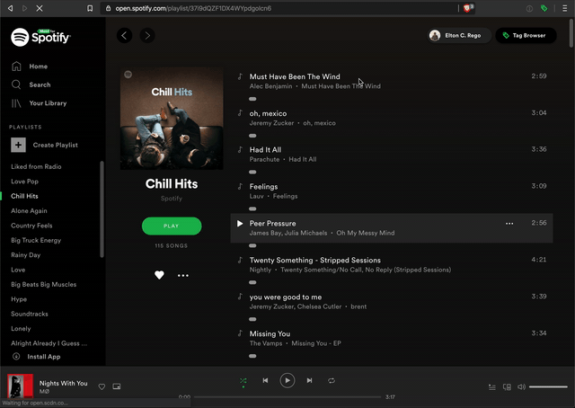

# Motif
Motif is a chrome extension we build to help Spotify users organize their music library based on various moods, genres, grouping, or generally whatever category you can come up with. The intent is to add a tagging and search system that, by adding tags to the songs you listen to, you'll be able to generate playlists easily based on your listening preferences at the time.

## Getting Started
We haven't published this extension to the chrome web store yet, but if you want to get it running and play around with it, you'll have to load the extension in yourself. We've provided instructions on how to do this in the readme at the extension folder level in this repo.

## Overview of Features
After the chrome extension is installed, the user simply has to visit any list of songs in the [Spotify Web Player](https://open.spotify.com/). Right now, we support Album and Playlist views in the Web Player; however, we do plan to add additional functionality for other pages in the near future as our time frees up.

Here is what it looks like when you load the UI.
