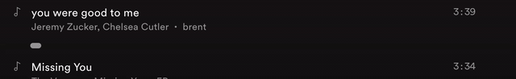

# Motif
Motif is a chrome extension we build to help Spotify users organize their music library based on various moods, genres, grouping, or generally whatever category you can come up with. The intent is to add a tagging and search system that, by adding tags to the songs you listen to, you'll be able to generate playlists easily based on your listening preferences at the time.

## Getting Started
We haven't published this extension to the chrome web store yet, but if you want to get it running and play around with it, you'll have to load the extension in yourself. We've provided instructions on how to do this in the readme at the extension folder level in this repo.

## Overview of Features
After the chrome extension is installed, the user simply has to visit any list of songs in the [Spotify Web Player](https://open.spotify.com/). Right now, we support Album and Playlist views in the Web Player; however, we do plan to add additional functionality for other pages in the near future as our time frees up.

### Loading the UI
Here is what it looks like when you load the UI.

### How to Tell if the Extension is Running
You can tell that the extension is running by checking the Spotify logo in the top left. If the extension is running, you'll see the logo get updated with an indication that Motif is acting as a layer on top of the Web PLayer.

### Adding Tags to Songs
You can add a tag to a song, by hovering over the gray button that appears below every song in a given list. Then click the button to open up a text input for your tag. After entering your text hit the enter key on your keyboard to confirm and the tag will be attached to that song.

### Removing a Tag from a Song
You can remove a tag from a song by clicking the remove ('x') button on the tag.

### Creating a Playlist from your Tags
To create a playlist based off your tags, click on the Tag Browser button in the top right corner.

Then type the name of a tag in the search bar at the top of the dialog.

Our search bar supports ORs...

and it also supports ANDs!

After that, you just have to click create playlist and confirm your decision and you'll find the songs have been grouped in the "Motif Playlist" on your account.

